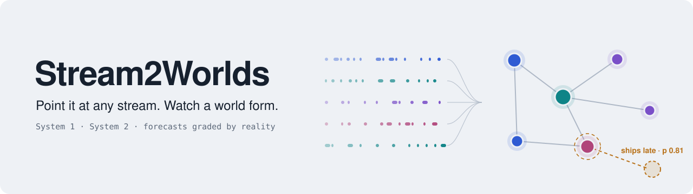
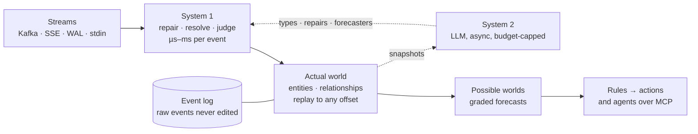

<p align="center">
  <picture>
    <source media="(prefers-color-scheme: dark)" srcset="docs/assets/banner-dark.svg">
    
  </picture>
</p>

<p align="center">
  
  
  
  
</p>

<p align="center"><b>Point <code>s2w</code> at an event stream you have never seen and watch a model of the world behind it form. Every forecast it makes is graded against what the stream shows next. The LLM never touches an event.</b></p>

> [!NOTE]
> **A research project, pre-alpha.** Each gate is a pre-registered question that can fail, and every result, negative ones included, is published. `s2w watch` runs today against Wikipedia, Kafka, generic Server-Sent Events streams and stdin, streaming into a durable log that resumes across restarts; `s2w mcp` exposes seven read-only query tools over stdio and can replay an on-disk world. Gate 1 (the evaluation contract) is signed; gate 2 (the harness) has its workspace, its fitness functions, the append-only event log, three sources, the pure fold with golden replay, a world query API and read-only MCP; `s2w serve <source>` ingests, bridges and serves a live query API in one process, and the same port serves a local web view: an evidence table and a 2D entity graph. The [roadmap](#roadmap) says exactly where we are. Opinions are held lightly.

## Latest

*Updated at the end of every sprint. The full story is in the [changelog](CHANGELOG.md).*

- **`serve` runs the stream mapping you accepted, and names the engine after it.** Routes are
  data: each source runs the mapping its accepted `stream-mapping` proposal names, and the
  engine is named by the mapping's identity, so a changed mapping never serves the old one's
  verdicts or snapshots. [Decision 0023](docs/decisions/0023-routes-from-stored-mappings.md)
- **Humans can grade proposals.** `s2w proposals list|grade|decide` shows the proposal store
  and records a human accept or reject, the decision that grades a producer and can revoke the
  stream mapping a source runs. A running `serve` picks up a decision live and rebuilds the world ([#184](https://github.com/daveremy/stream2worlds/issues/184)).
  [#185](https://github.com/daveremy/stream2worlds/issues/185)
- **Restarting from a snapshot takes about half the memory.** A restored world is shared
  instead of copied, and writing a snapshot no longer clones the world: folding 10^6 events the
  restore peak fell from 1,624 MiB to 861 MiB and the write peak from 919 MiB to 50 MiB.
  [#179](https://github.com/daveremy/stream2worlds/issues/179)
- **Scale is measured, in part, on real traffic as well as synthetic.** The scale gates replay
  a recorded 10-minute Wikipedia stream (11,667 events) alongside the seeded generator: the
  recorded world holds 346 bytes per entity and the synthetic one 360, down from 830, both
  checked in `cargo xtask check` against a 600 B ceiling (decision 0004's 2× line; the planning
  figure is 300 B); fold instructions per event are gated for both in CI job `scale`. Parse
  cost, fork cost and per-partition lag are not measured yet.
  [#174](https://github.com/daveremy/stream2worlds/issues/174) · [#172](https://github.com/daveremy/stream2worlds/issues/172) · [#190](https://github.com/daveremy/stream2worlds/issues/190)
- **`serve` learns a mapping for a new stream and applies it.** At start, a source with no
  mapping and at least 10,000 logged events is profiled by `s2w-discover`; the mapping is filed
  as a proposal and accepted by `policy`, on the record and revocable with `s2w proposals
  decide --outcome reject`. The profiler reads statistics, never names, and `cargo xtask check`
  proves it on an obfuscated copy of a recorded stream. [Decision 0025](docs/decisions/0025-learned-mapping-auto-apply.md)
- **A source that reaches the window while `serve` runs is profiled then**, its mapping filed
  and accepted on the spot and routed by the live rebuild. [Decision 0025](docs/decisions/0025-learned-mapping-auto-apply.md)
- **In progress:** the world a learned mapping builds is 110 to 1,010 MiB at 10^5 events, so a
  name-free prune is next ([decision 0022](docs/decisions/0022-discover-profiler.md)). Also in progress: the epoch contract and live rebuild, so a running `serve` picks up a
  decision without a restart ([#184](https://github.com/daveremy/stream2worlds/issues/184)).

## Demos

One command each after `cargo build --release`, no other configuration. Newest first — see
[`demos/`](demos/) for what each one shows and a captured real run.

- **[serve-wikipedia](demos/serve-wikipedia/)**: `./demos/serve-wikipedia/run.sh` — one process
  ingests Wikipedia's live edits and serves the resulting world over HTTP.
- **[watch-wikipedia](demos/watch-wikipedia/)**: `./demos/watch-wikipedia/run.sh` — live stream
  into a durable log, with a progress line while healthy and a resume across restart.

---

## The idea

Every organization already describes itself in streams: orders, shipments, edits, sensor readings, database writes. Almost nobody sees them as a whole, because turning a stream into a model of the business has always meant a schema project and a data team.

Stream2Worlds (`s2w`) skips that step. A stream is many entities' lives interleaved: every cart, customer and flight emitting events on its own schedule. `s2w` untangles it into a **world**, typed entities, relationships and state, rebuilt from the log so you can scrub it back to any moment. Then it forecasts what each entity does next, draws those forecasts as **possible worlds**, and grades every one against what actually happens.

A **possible world** here is one sampled future of the world, rolled forward from the present state. A forecast is a question asked across many such samples, recorded before the outcome and graded after it. (Probabilistic databases use the same phrase for uncertainty about the *present*; `s2w` borrows their Monte Carlo semantics and points them at the future. See [research 0001](research/0001-prior-art.md#q2-possible-worlds-as-a-term).)

## What the demo will show

None of this exists yet. It is the demo the first slice builds toward, and each line names the gate that has to pass first.

- **One command, no configuration.** `s2w watch <stream>` and raw events start flowing. (gate 2)
- **A world assembling itself.** Ids become entities, entities get types and names, the graph tidies itself as it learns. (gate 2 for the evidence view, gate 3 for the learning)
- **Structure, not memorized names.** Gate 3 feeds `s2w` a copy of a stream with every field renamed to `f1…f17` and every id hashed. It has to recover the entities and their keys anyway, and it is scored against heuristics and against an LLM shown raw events.
- **Possible worlds.** Forecasts appear as dashed ghosts with probabilities, then turn solid or shatter when reality arrives, and the scorecard ticks. (the ledger in gate 4; the view after the slice)
- **Time travel.** One scrubber replays the past exactly and imagines the future probabilistically. (gate 2 for replay; the future view after the slice)
- **Ask it from your agent.** Claude, Codex or any MCP client can query the world, ask for forecasts with their track records, and propose rules. (read-only MCP in gate 2)

## How it works

Two systems over one log. **System 1** runs on every event in microseconds to milliseconds: rules, embeddings, and fast decision models such as Jev. **System 2** runs in the background in seconds: an LLM that reads snapshots of the world, proposes types, repairs and forecasters, and teaches System 1. System 2 never sits in the stream. That is the lesson from this project's predecessor, which put the LLM on the event path and was too slow.



| Principle | What it means |
|---|---|
| **The world is a replay of the log** | Entities and state are a projection, so any moment can be replayed, both as the system knew it then and as it understands it now. |
| **Repairs happen in the open** | Messy streams get aliases, links and type mappings as events of their own, with a confidence and a source. Nothing raw is ever edited, and any repair can be revoked. |
| **Reality grades every forecast** | A forecast is an immutable record with a horizon. Its outcome is scored separately, so every forecaster carries a public track record. Questions are registered with a cutoff, a horizon, outcome sources and baselines, the same shape as the [contract](docs/evaluation-contract.md) `s2w` was evaluated under before any code was written. |
| **If this, then that, across worlds** | One small language for queries, subscriptions and rules that read the world or a forecast and act through plugins. |
| **Agents are first-class clients** | A read-only MCP server exposes the world, forecasts, evidence and a ranked attention feed. The dashboard is where people see what agents saw and did. |
| **Visualization is first class** | The view is built with the core, not after it: every gate ships its capability, the view that shows it to a person, and the MCP surface that shows it to an agent ([decision 0017](docs/decisions/0017-view-and-agents-first-class.md)). The view stays domain-free; System 2 will tailor it to each domain with a view spec that is itself an event in the log. |

## Running today

```bash
# stream Wikipedia page changes into a local SQLite event log (default ./s2w-data)
s2w watch wikipedia --log-dir ./s2w-data

# Or ingest, bridge and serve the live query API in one process (instead of watch):
s2w serve wikipedia --log-dir ./s2w-data --port 4310 --world default
# From another terminal:
curl http://localhost:4310/worlds/default/world
# Or open http://localhost:4310/ in a browser for the web view (evidence table and graph);
# add ?at=<offset> to the URL to pin a moment.
curl http://localhost:4310/worlds/default/sources
# serve snapshots the world every 1,000,000 raw events and on Ctrl-C/SIGTERM, and restarts
# from the newest valid snapshot; tune or disable with --snapshot-every <n> / --no-snapshot

# replay history first; only for a log that has no stored cursor yet
s2w watch wikipedia --since 2026-09-27T00:00:00Z --log-dir ./fresh-dir

# machine-readable progress instead of the human status lines: one NDJSON object per flush on
# stdout, errors on stderr
s2w watch wikipedia --json --log-dir ./s2w-data

# your Kafka topic: reads by partition assignment, never joins a consumer group, commits nothing
s2w watch kafka://localhost:9092/orders --log-dir ./s2w-data

# any Server-Sent Events stream over https — ids are stored verbatim, no --since
s2w watch https://stream.example.org/v2/recent --log-dir ./s2w-data

# newline-delimited JSON already on your machine
kcat -C -b broker:9092 -t orders | s2w watch - --log-dir ./s2w-data
```

Stop it with Ctrl-C. Run it again on the same `--log-dir` and it resumes from the stored cursor (Wikipedia's `Last-Event-ID`, a generic SSE stream's `id:`, or a Kafka partition's last offset), not from now. Events redelivered on resume are collapsed by the log, which dedupes on source plus payload content, so two distinct events sharing a millisecond are both kept. Passing `--since` to a log that already has a cursor is a usage error; a generic SSE or stdin source never accepts `--since` at all.

`serve` creates an immutable world manifest in `events.sqlite3` on first open. Reusing that
same directory with a different `--world` is an error. Existing schema-v2 event logs migrate
atomically to v3, preserving events and cursors. `/worlds` uses the stored display name.

Every offset-taking route serves offsets from `base` to `head`, both reported by
`GET /worlds/{world}/time`. `serve` keeps only the most recent 20,000 world events
([decision 0026](docs/decisions/0026-bounded-timeline-history.md)): `base` is 0 while it still
holds every event since offset 0, and the head after it drops older ones or restarts from a
world snapshot ([decision 0024](docs/decisions/0024-snapshots.md)). `/events` replays from
`replay_base`, also in `/time`: the offset before the oldest event it keeps. `serve` writes a
snapshot under `<log_dir>/snapshots/` every 1,000,000 raw events (`--snapshot-every <n>`) and, on Ctrl-C or
SIGTERM, when at least 100,000 events arrived since the last one; at start it loads the newest
valid snapshot and replays only the tail (`--no-snapshot` turns both off and replays from 0).
`/world?at=`, `/diff?from=` and `/time?ts=` below `base`, `/events?from=` or `Last-Event-ID`
below `replay_base`, and `/entity/{id}/history` whenever `base` is not 0 answer `410` with
`{"error": "offset_before_base"}`. The web page restarts from a fresh read when its live stream
falls behind `replay_base`. The MCP tools share this contract.

Offsets belong to a history, named by its **epoch** (16 hex digits, reported by `/world`,
`/time` and every SSE `id:` as `<epoch>:<offset>`; [decision 0023](docs/decisions/0023-routes-from-stored-mappings.md)).
A restart under another stream mapping serves a new epoch. Pass `?epoch=` (or a
`Last-Event-ID` with the prefix) to pin one: if the served history has changed, the route
answers `410` with `{"error": "stale_epoch"}` rather than another history's world, and an open
`/events` stream ends with one `stale_epoch` error event. Bare offsets are served as before.

`GET /worlds/{world}/sources?at=N` returns a JSON array of `SourceInfo`, one per source ID
active at `N` (sorted by source id); omitting `at` uses the current timeline head. An addition
is visible at its recorded offset, a removal is already absent at its offset, and the latest
sequence wins equal-offset ties. Membership offsets currently record the event-log head, as
required by the #95 storage plan; raw events can produce zero or multiple fold events, so these
offsets do not generally equal timeline offsets. This precision limitation needs resolution
before a live admin mutation API.

Each `SourceInfo` also reports the bridge's current counters for that source — `consumed`,
`unrouted`, and the most recent unrouted raw events (`recent_unrouted`, newest first, capped)
— independent of `at`: the counters always reflect the bridge's live state, not history as of
the pinned offset (#143). The web view uses this to name an unrouted source instead of saying
nothing arrived. While `serve` rebuilds the world after a mapping change (decision 0023,
"Rebuild"), a source whose mapping changed also carries `rebuilding` (`identity`,
`since_position`); the field is absent otherwise.

Membership changes currently use the `s2w-log` library; there is no add/remove CLI or HTTP
mutation endpoint. Removed sources stop ingestion while HTTP remains available. Re-add with
an explicit source cursor, then restart `serve` to resume; `EffectiveFrom::Now` on a re-add
returns `ReaddRequiresCursor` until adapters support resolving a live tail. First-time
membership uses the adapter's normal initial position. Kafka bootstraps each partition ID
and skips removed partitions at startup; a removal during a running multiplexed worker stops
that worker until restart. Past events remain in the world.

If you run Kafka: `s2w` is a read-only observer of your topic. It assigns partitions itself, joins no consumer group, commits no offsets, and keeps its own cursors in its local log ([decision 0007](docs/decisions/0007-kafka-client.md)).

To connect an MCP client, configure it to launch `s2w mcp --log-dir ./s2w-data` (for example, `claude mcp add s2w -- s2w mcp --log-dir ./s2w-data`). It exposes `world_view`, `world_diff`, `entity_history`, `branches`, `sources`, `time` and `proposals_list` (System 2 proposals, their decisions and the per-class, per-actor grade, read from `proposals.sqlite3`); each requires `world` (default `"default"`, configurable with `--world`) and returns the same JSON as its HTTP query route. With no `--log-dir`, MCP serves an empty world for backward compatibility. With one, it takes a read-only snapshot of committed verdicts without taking either writer lock, so `s2w serve` can keep appending, and refreshes that snapshot periodically (about every 500ms) as new verdicts commit, so results reflect live activity while a writer is active. World manifest (display name) and membership-history metadata load once at open and stay frozen for the life of the process — they do not follow the periodic refresh. Prefix either command with `--json` (`s2w --json serve ...`, `s2w --json mcp ...`) for structured stderr notes/errors; `serve` also streams the same per-flush NDJSON progress lines as `watch --json` on stdout while ingesting, and MCP only applies the flag to startup/usage errors because stdout carries JSON-RPC messages exclusively once serving. The flag is prefix-only for these commands. See [decision 0009](docs/decisions/0009-mcp-server.md). `s2w mcp --log-dir DIR --allow-decisions` additionally registers `decision_record` (`world`, `proposal_id`, `outcome`, `basis`), which appends one decision row with the `agent` decider and never edits a proposal; an agent's opinion is tallied separately and never counts toward the human or policy grade ([decision 0020](docs/decisions/0020-proposal-surfaces-and-agent-decider.md)); the human decision is written by the `s2w proposals decide` CLI below, never over MCP. The web view shows the same proposals and grades in a Proposals panel, and `GET /worlds/{world}/proposals` returns them as JSON.

`serve` proposes a stream mapping itself. At start, before it builds its routes, it profiles
the first 10,000 logged events of each source that has no mapping, with `s2w-discover`. A
mapping is stored as a `stream-mapping` proposal from `h-lite` and accepted by the `policy`
decider in the same start, so the source is routed, backfilled and live at once; the start-up
notes say `discover: <source>: proposed mapping <identity> (proposal <id>), accepted by
policy learned-mapping-auto-apply/1`. A source with fewer events, or one the profiler abstains
on, is noted and stays unrouted. A restart writes nothing new, and neither does a start after a
human reject: `s2w proposals decide --proposal <id> --outcome reject` (with `--basis` and
`--reviewer`, below) revokes the mapping for good ([decision 0025](docs/decisions/0025-learned-mapping-auto-apply.md)).

Humans review proposals from the command line. `s2w proposals list [--log-dir DIR] [--json]`
prints every stored proposal with its decisions, then which stream mapping each source runs and
which mapping rows routing excludes, and why; `--json` prints the same view the query API and
MCP serve. `s2w proposals grade [--log-dir DIR] [--json]` prints the grades per class and actor.
Neither creates `proposals.sqlite3`: a missing store reads as empty. `s2w proposals decide
--log-dir DIR --proposal ID --outcome accept|reject --basis TEXT --reviewer ID` appends one
decision with the `human` decider, the only decider whose review grades a producer. The store
has no reviewer column, so the basis is stored as `reviewer=<id>; <text>`; this prefix is the
human-decider convention (an agent's basis stays verbatim), and `--reviewer` refuses
whitespace, control characters and `;` so the prefix always splits cleanly. For a
`stream-mapping` proposal, `decide` also prints what the source runs after the write: a reject
of the mapping a source runs revokes it, back to the previous accepted mapping or to unrouted
([decision 0023](docs/decisions/0023-routes-from-stored-mappings.md)). A running `s2w serve`
sees the change within a poll and rebuilds the world under the new routes (#184 2b-ii). An accept on a
mapping proposal whose payload does not decode is refused, because routing excludes that row
whatever is decided; a reject is always allowed. Exit codes: 0 recorded; 2 for a usage error;
1 for a data error (`unknown_proposal`, `store_locked`, `bad_parameter`, `storage`), with the
same `{"error", "message"}` body on stderr under `--json` that HTTP and MCP use. `store_locked` is exit
1, not 2, because the writer lock is held only for one append, so a retry succeeds; nothing
about the command was wrong.

## Planned interface

This is the target shape. `s2w watch wikipedia`, `s2w watch kafka://…` and `s2w mcp` above run
today. Still to build: reading only some partitions or sampling entities by key on a busier
Kafka topic.

```bash
# for a busier topic, read some partitions or sample entities by key
s2w watch kafka://localhost:9092/orders --partitions 0,1 --sample 1/4

# then ask it from your coding agent
claude mcp add s2w -- s2w mcp
```

`s2w` targets about 1,000 events/s on a laptop. Local by default: nothing leaves your machine unless you approve an export manifest.

## Evaluation

A forecast you cannot check is an opinion. `s2w` grades its own predictions against what the stream later shows, and it grades itself the same way.

| What is graded | Against what | When |
|---|---|---|
| **Every forecast**, from any predictor: a rule, embeddings, a decision model such as Jev, an LLM | The outcome the stream later reports, and matched baselines: the base rate, a simple-features model, and any reference model you name | Continuously, once the forecast ledger lands (gate 4) |
| **Every judgment**: System 1 verdicts and System 2's proposed types, merges and repairs | Your accept or reject, and later evidence (a merge that later splits counts as a false merge) | After the first slice |
| **`s2w` itself** | A [pre-registered contract](docs/evaluation-contract.md), written before any code: the question, the eligible events, the baselines and the pass thresholds | Gates 3 and 4 |

Stream outcomes are awkward to grade, and the ledger is built around that:

- **Outcomes arrive late.** Each question fixes a deadline for deciding its outcome. Anything learned after that deadline is recorded as an audit and never rewrites the label.
- **Some outcomes are never observable.** A deleted page or an unrecoverable gap in the stream makes the outcome censored, not wrong. The evaluator, not the predictor, decides what is censored, and every result carries a worst-case check: would it survive if every censored case had gone against it?
- **Forecasts cannot be rewritten.** A forecast is fixed when it is issued. Replays, repairs and restarts never change it, and pruning a branch from the view never removes it from the score.
- **Abstaining can't fake skill.** A predictor may decline to answer; its abstentions are scored as base-rate guesses, so declining everything earns exactly zero skill, and how often it really answered is published beside its score.

Each predictor's record (graded count, skill over the base rate, calibration) is what `forecast.ask` returns alongside a probability, and what the System 1 router will use to pick an engine. `s2w` is not a general LLM eval framework. It grades forecasts and judgments against a live stream, the part existing eval tools do not cover.

**The first question, with its numbers.** Gate 4 asks, for each human edit to an English Wikipedia article: will it be reverted within 30 minutes? A 30-minute pilot on 2026-09-27 ([research 0004](research/0004-revert-pilot.md)) measured 1,854 eligible edits, a 3.8% base rate, and ROC AUC 0.888 for Wikimedia's own revert-risk model on that question. One Sunday-morning window, so these are orders of magnitude, not the test. Wikimedia's model is reported beside `s2w`'s score, not required to be beaten: the gate asks for skill over the base rate and over a simple-features model, and calibration ([contract A9](docs/evaluation-contract.md#a9-gate-4-pass-thresholds-dave-2026-09-27-report-b2-dont-require-it)).

## Roadmap

The first slice is four gates and a launch, each able to fail honestly. A runnable demo on live data ends every sprint.

- [x] **Gate 1 — the evaluation contract.** [Signed 2026-09-27](docs/evaluation-contract.md) after five review rounds. The question, how outcomes are labelled, the baselines to beat, and pass thresholds, written before any code.
- [x] **Gate 2 — the local harness.** Rust workspace, three sources, the log, the pure fold with golden replay, an evidence view, read-only MCP. The workspace skeleton, fitness functions, the append-only event log, the Wikipedia/Kafka/generic-SSE sources, the pure fold with golden replay and the named-world query API are built; read-only MCP over stdio is also built; `s2w serve` wires ingestion and the live bridge into HTTP, and serves the evidence view (an evidence table and a 2D graph) from the same loopback port; a scale fitness function gates heap bytes per entity and measures fold instructions per event, whose baseline is set from the first CI run (parse, fork and lag not yet measured). ([milestone](https://github.com/daveremy/stream2worlds/milestone/1) · [epic](https://github.com/daveremy/stream2worlds/issues/12))
- [ ] **Gate 3 — does System 2 earn its place?** Heuristics against heuristics plus System 2, on Wikipedia, an obfuscated copy, and a private stream. ([milestone](https://github.com/daveremy/stream2worlds/milestone/2) · [epic](https://github.com/daveremy/stream2worlds/issues/13))
- [ ] **Gate 4 — one forecast ledger.** One question, independent outcomes, matched baselines, skill and coverage reported. ([milestone](https://github.com/daveremy/stream2worlds/milestone/3) · [epic](https://github.com/daveremy/stream2worlds/issues/14))
- [ ] **Launch.** The split-screen demo, one install path, open source. ([milestone](https://github.com/daveremy/stream2worlds/milestone/4) · [epic](https://github.com/daveremy/stream2worlds/issues/15))

After the slice: the revert forecast re-run on non-English Wikipedias (the first measurement is English-only by choice; `s2w` itself is built for streams in any language), the full possible-worlds view, a 3D explorer for moving through a world and its possible futures, rules with dry-run actions, the ADS-B air-traffic demo, and sharing through an approved export manifest.

## Architecture, continuously

Good architecture from the first commit, paid down every sprint instead of in a someday cleanup:

- a **pure functional core** (events in, world out; time and randomness passed in) inside an imperative shell;
- **layers enforced by the build**: a per-crate dependency allowlist, replay determinism, and escape hatches (`unwrap`, `#[allow]`, `todo!`) denied by the compiler, checked on every PR;
- **every seam ships with two real implementations** in the first slice, so no abstraction is designed from a single case;
- an `AGENTS.md` in every crate, because most of the code will be written by coding agents.

Decisions live in [`docs/decisions/`](docs/decisions/).

## How embeddings fit in

> **2026-09-28:** the local embeddings engine and the Wikimedia-bound rules engine this section
> describes were retired under [decision 0018](docs/decisions/0018-no-compiled-domain-code.md)
> (no compiled domain code); only `JsonClaimsEngine` ships today. Left below as a record of the
> design that ran during gates 2–3, not as a description of current behavior.

Local embeddings are one of three System 1 engines, running alongside rules and JSON claims
behind the same verdict/confidence/abstain trait — additive, not a replacement. Rules read the
structure of a Wikimedia page-change event (page id, revision id, performer); embeddings read
its one free-text field, `revision.comment`, and classify it into an edit category (`revert`,
`vandalism_repair`, `content_addition`, `content_removal`, `minor_edit`, `structural_edit`) by
similarity to fixed example phrases. Both engines run on the same event and write to the same
page entity, so a page's world state carries both the rules engine's structural fact
(`last_rev_id`) and the embeddings engine's judgment about what that revision did
(`last_edit_category`, with `last_edit_category_rev_id` naming which revision it describes —
read it as a snapshot of the most recent edit, not a running summary of the whole page).

Confidence here is a similarity score to the nearest category, rescaled to basis points — not a
calibrated probability. Below a threshold, or too close a tie with the runner-up category, the
engine abstains rather than guessing, so a low-confidence comment produces silence, not a forced
guess. That does not guarantee an accepted classification is correct — an unrelated comment can
still score above both threshold and margin and pick the wrong category with apparent
confidence; threshold/margin calibration against real traffic (named as a follow-up below)
narrows that risk, it does not eliminate it. Scoped to `enwiki` only in this slice, since the
underlying model is English-only. Full design, the version-pinning scheme, and named calibration
follow-ups: [decision 0013](docs/decisions/0013-local-embeddings-engine.md).

## Technical architecture

What `s2w` is built on, and what is deliberately not built yet. **Building** means part of the first slice, in the gate named; **later** means after the first slice; **on trigger** means we switch only when the named measurement says so.

| Part | Choice | Status | Why, or what would change it |
|---|---|---|---|
| Language and delivery | Rust, one static binary | building (gate 2) | Small enough to drop into someone else's network; predictable memory, no GC pauses in the stream, good async I/O for many sources. |
| Workspace | `s2w-model` ← `s2w-core`, `s2w-log`, `s2w-sources`, `s2w-system1`, `s2w-system2` ← `s2w-app` ← `s2w`; `s2w-testkit` for tests; `s2w-discover` → `s2w-model`, used by `s2w-app` | building (gate 2) | The workspace is the architecture: core, model and discover do no I/O, adapters depend only on the model, the app composes them. |
| Serialization and errors | `serde`, `serde_json`, `thiserror` | building (gate 2) | The model's dependencies, plus `serde` in the core so a world serializes; typed errors in libraries. |
| Fitness functions | `cargo xtask check` (`toml`, `serde_json`, `syn`, `proc-macro2`; `sha2` pins `cargo xtask h-measure`'s keys and corpora) | building (gate 2) | Dependency allowlist by identity, this table by exact name, AGENTS.md in every crate, workspace lint inheritance, clippy function-size thresholds (60 lines, complexity 15, 5 arguments) kept equal in every crate's clippy config, report-only module sizes with a blocking exemption-growth ratchet, report-only module cycles within a crate (enforced once s2w#240 and s2w#241 break the cycles it finds), and golden replay: the golden log folds to the same bytes twice, from any serialized prefix, and matches the human-owned snapshot; an obfuscation replay of the `s2w-discover` profiler; and no decision-record number used twice. |
| Property & snapshot testing | `proptest`, `insta` | building (gate 2) | Property tests check the fold's entity identity against an independent reference model and resume from any serialized prefix; `insta` pins the fold's output shape for human review. Test-only dependencies of `s2w-core`; `s2w-app` also uses `proptest` to check that a world restored from a snapshot plus its tail equals the full fold. |
| Licence and advisory gate | `cargo deny check licenses advisories bans` | built (gate 2) | Dependencies must stay permissive: MIT, Apache-2.0, ISC, BSD-3-Clause or Unicode-3.0, plus two scoped exceptions (`foldhash` Zlib, never compiled for our targets; `webpki-root-certs` CDLA-Permissive-2.0, the Mozilla CA bundle), per [research 0003 §8d](research/0003-rust-substrate.md#8d-licences). RustSec advisories must not silently ship. |
| Sources | A `Source` registry resolved by URI scheme ([decision 0008](docs/decisions/0008-generic-sse-adapter.md)): Kafka by partition assignment via `rskafka` (never a consumer group, never commits; [decision 0007](docs/decisions/0007-kafka-client.md)), a generic SSE adapter via `reqwest`/`tokio`/`tokio-stream` with named presets (e.g. `wikipedia`) as URL+settings data over it ([decision 0003](docs/decisions/0003-wikipedia-sse-client.md)), and stdin NDJSON | built (gate 2) | Three real transports plus a preset, so the source seam is not designed from one case. |
| Scale | One process on a 4-core, 16 GB laptop: 1,000 events/s, 10^6 live entities in 1 GB, 20 possible-world forks in under 100 ms. Measured by `gungraun` (Valgrind instruction counts), `dhat` (heap bytes) and a `rustix` statfs tmpfs check | partly measured (gate 2) | Heap bytes per entity (`cargo xtask check`) is gated against `xtask/scale-baseline.toml`. Fold instructions per event (`cargo xtask scale`, CI job `scale`) is gated against the same file, with baselines set from CI runs. Append events/s is reported, not gated. Each number is measured on two event supplies side by side ([#174](https://github.com/daveremy/stream2worlds/issues/174)): a seeded synthetic generator (100,000 events) and a recorded 10-minute Wikipedia stream (11,667 raw events, 58,335 mapped claims). Synthetic: 5,764 Ir/event and 360 bytes per entity (1.20× the 300 B planning figure). Recorded: 15,285 Ir per raw event and 346 bytes per entity (1.15×), 409 B per relationship. Bytes are dhat live heap, test profile, entities folded before relationships, before allocator overhead, under a 600 B ceiling (decision 0004's 2× line); [#172](https://github.com/daveremy/stream2worlds/issues/172) cut the synthetic figure from 830 B and [#190](https://github.com/daveremy/stream2worlds/issues/190) to 360 B; [#191](https://github.com/daveremy/stream2worlds/issues/191) works toward 300 B. Parse cost, fork cost and per-partition lag are not measured yet. Not a distributed system: bigger topics use `--partitions` or `--sample 1/N by key` ([decision 0004](docs/decisions/0004-scale-envelope.md), [research 0006](research/0006-scaling.md)). |
| Event log | Append-only SQLite log (`rusqlite`, WAL, synchronous FULL) with source cursors and provenance | built (gate 2) | Each append stores its event and advances its source cursor in one transaction; raw events are never edited. |
| World computation | Pure fold over the log; each forecast world recomputed from a snapshot | built (gate 2) | Simplest thing that replays deterministically. Ids are assigned once and never reused; merges alias, revokes split ([decision 0005](docs/decisions/0005-pure-fold.md)). Forecast worlds wait for branches. |
| World snapshots | A derived file per snapshot under `<log_dir>/snapshots/`: magic, length, a `postcard` payload holding the folded world, and an FNV-1a checksum ([decision 0024](docs/decisions/0024-snapshots.md)) | building (gate 2) | Restart cost is bounded by the tail after the newest snapshot instead of the whole log. A snapshot is loaded only when its format, fold, engine routing and log position all still match; otherwise it is ignored and the log replays from 0. `serve` writes them periodically and on stop, and restarts from the newest valid one. |
| World query API | HTTP over the folded world in `s2w-app` (`axum`, SSE deltas; `tower` in tests): `/worlds/{world}/world` at any offset and level of detail, `/worlds/{world}/events` (optionally bounded by `at=`), `/worlds/{world}/branches`, `/worlds/{world}/diff`, `/worlds/{world}/entity/{id}/history`, `/worlds/{world}/time`, `/worlds/{world}/sources?at=`, `/worlds/{world}/proposals`, plus `/worlds` discovery ([decision 0006](docs/decisions/0006-world-query-api.md), [decision 0015](docs/decisions/0015-named-worlds.md)) | built (gate 2) | One contract for the web view, `--json` and MCP, and later the 3D explorer. Serves the actual branch of one named world per process (`branch=` other than actual and `lod=cluster` answer 501); `s2w mcp` exposes its seven world-scoped read tools over stdio; the loopback HTTP listener ships as `s2w serve <source>` ([decision 0014](docs/decisions/0014-serve-topology.md)) with a cap of 32 concurrent event streams and an `Origin` allowlist ([decision 0016](docs/decisions/0016-web-delivery.md)). |
| Incremental engine | [Differential Dataflow](https://github.com/TimelyDataflow/differential-dataflow) first (7 direct dependencies, no runtime), [Feldera's DBSP](https://github.com/feldera/feldera) runner-up; world branch as a column | on trigger | Switch when forks × world size misses a 100 ms frame budget ([research 0003](research/0003-rust-substrate.md)). The predecessors used Differential Dataflow (worldcraft) and Timely (timely_worlds). |
| System 1 engines | JSON claims, stream mapping | building (gate 2–3) | Two engines ship behind the verdict/confidence/abstain trait: JSON claims, a payload that already is a claim, and a data-driven stream-mapping executor. `serve` routes a source to the mapping its accepted `stream-mapping` proposal names, and the engine is named by the mapping's identity, so a changed mapping never serves the old one's verdicts or snapshots ([decision 0023](docs/decisions/0023-routes-from-stored-mappings.md)). Every verdict is stored before its claims are served, and a restart replays stored verdicts instead of re-running engines ([decision 0012](docs/decisions/0012-verdict-log.md)). A heuristic profiler, `s2w-discover`, proposes the stream mapping a generic executor will run, or abstains; it reads statistics, never names ([decision 0022](docs/decisions/0022-discover-profiler.md)). At start `serve` profiles each unrouted source's first 10,000 events and files and `policy`-accepts what it proposes ([decision 0025](docs/decisions/0025-learned-mapping-auto-apply.md)). |
| System 1, decision models | TypeSafe's Jev and similar models, as a third engine behind the same trait | later | Nobody has measured Jev's latency, cost or accuracy on these questions; it joins through the bake-off, p50/p99 and accuracy per engine. |
| System 1 router | Each judgment names a latency budget; rule → embeddings → decision model | later | Needs more than one engine worth routing between. |
| System 2 | A hosted LLM API on a fixed budget; the client's own agent via MCP sampling, or a local model | building (gate 3) | Asynchronous, never in the stream. Two providers differ in latency, cost and where data goes. |
| Read-only MCP server | `s2w mcp` over stdio using `rmcp` `=3.4.1`; seven read-only tools share the query API, plus the opt-in `decision_record` write ([decision 0009](docs/decisions/0009-mcp-server.md)) | built (gate 2) | Read-only annotations and identical JSON responses. `--log-dir` replays stored verdicts while the writer remains active, refreshing periodically (about every 500ms) and serving world manifest and membership-history metadata loaded once at open; no flag keeps the empty-world behavior. HTTP MCP transport is deferred. |
| Dashboard | Local web view: an evidence table and a 2D graph (`force-graph`), a TypeScript bundle built by esbuild and embedded in the binary with `memory-serve` ([decision 0016](docs/decisions/0016-web-delivery.md)) | built (gate 2) | The committed bundle means a Rust build never needs Node, and one binary serves both the API and the view. The view reads the world through the same query interface as MCP, and the graph sits behind a renderer interface, so the 3D world explorer built on three.js ([#21](https://github.com/daveremy/stream2worlds/issues/21), [research 0005](research/0005-3d-exploration.md)) replaces only the renderer. Ghosts, cones, scrub-past-now and live calibration come after the slice. |
| Forecast ledger | Immutable issuances plus appended outcome observations | building (gate 4) | Scored against base rate and Wikimedia's revert-risk model. See the [evaluation contract](docs/evaluation-contract.md). |
| Actions | WebAssembly plugins with host-enforced egress, secrets and limits | later | Customers add actions without touching the core. |

This table is checked, not just maintained: `cargo xtask check` fails when a workspace crate is missing from this section, or when an external dependency does not name a row here ([decision 0001](docs/decisions/0001-workspace-layers.md)).

## Building

Build with `cargo build --release` and run `target/release/s2w watch wikipedia`. The gates that CI runs on every pull request:

```bash
cargo fmt --all --check
cargo clippy --workspace --all-targets -- -D warnings
cargo test --workspace
cargo xtask check
cargo deny check licenses advisories bans
cargo xtask scale   # Linux only: needs valgrind and gungraun-runner (CI job `scale`)
```

Rust 1.98 or later. `cargo xtask check` is the fitness-function suite described above; when it fails, its message says what to change. The separate `cargo deny` gate rejects unapproved dependency licences and RustSec advisories. `cargo xtask scale` measures fold instructions per event under Valgrind; install `valgrind` and `cargo install gungraun-runner --version 0.20.0 --locked` (the version `s2w-app` pins for `gungraun`) first.

## Related work

Every part of `s2w` exists somewhere. As of 2026-09-27 we found no system that does all of it: discovering entity types, identity keys and relationships from a raw event stream, keeping the LLM off the event path, replaying the world from its log, and grading its own forecasts against the live stream. The full map, with citations, is [research 0001](research/0001-prior-art.md). The nearest neighbours:

- **[Graphiti](https://github.com/getzep/graphiti)** (Zep, [arXiv 2501.13956](https://arxiv.org/abs/2501.13956)) builds a temporal knowledge graph from a stream of episodes. It calls an LLM on every episode and resolves identity by name similarity. `s2w` calls its LLM on snapshots, compiles what it learns into rules that run without it, discovers identity keys from the data, replays deterministically from the log, and forecasts.
- **Object-centric process mining** discovers object types and their relationships from flat event logs, offline. The strongest method, [Rebmann, Rehse and van der Aa (BPM 2022)](https://doi.org/10.1007/978-3-031-16103-2_25), leans on attribute names; gate 3's obfuscated stream is the case where names carry nothing. `s2w`'s world maps onto the [OCEL 2.0](https://arxiv.org/abs/2403.01975) standard's objects and relationships.
- **Key discovery in databases**, such as [LLM-FK](https://arxiv.org/abs/2603.07278) and [Tursio](https://arxiv.org/abs/2603.04176), finds keys with statistics first and an LLM to adjudicate, on static tables.
- **Complex event forecasting**, such as [Wayeb](https://link.springer.com/article/10.1007/s00778-021-00698-x), issues and scores probabilistic forecasts on live streams, for patterns you write.
- **Wikimedia's [revert-risk model](https://meta.wikimedia.org/wiki/Machine_learning_models/Production/Language-agnostic_revert_risk)** already publishes a revert probability for every edit, live. Gate 4 uses it as the strong baseline. Its label has no time window; the gate-4 question asks about 30 minutes.

## Design and reviews

- [Changelog](CHANGELOG.md): the development arc, sprint by sprint
- [Research notes](research/): prior art, structure discovery without LLMs, the Rust substrate, the revert pilot
- [Design document](docs/design/stream2worlds-design.html) (interactive; open it locally in a browser)
- Design critic passes: [round 1, Codex](docs/reviews/round1-codex.md) · [round 1, Claude](docs/reviews/round1-claude-critic.md) · [round 2, Codex](docs/reviews/round2-codex.md) · [round 2, Claude](docs/reviews/round2-claude-critic.md)
- Evaluation contract reviews: [1](docs/reviews/gate1-contract-round1-codex.md) · [2](docs/reviews/gate1-contract-round2-codex.md) · [3](docs/reviews/gate1-contract-round3-codex.md) · [4](docs/reviews/gate1-contract-round4-codex.md) · [5, sign](docs/reviews/gate1-contract-round5-codex.md)
- Workspace skeleton reviews: [1](docs/reviews/skeleton-round1-codex.md) · [2](docs/reviews/skeleton-round2-codex.md) · [3](docs/reviews/skeleton-round3-codex.md) · [4, approved](docs/reviews/skeleton-round4-codex.md)
- [Decision records](docs/decisions/)

## Where it came from

It started at EventStore with a wish: switch on predictions for an event store the way you switch on a projection. That became [PredictStream](https://predictstream.ai), a pipeline of pluggable agents that proved the idea and hit a wall: LLMs in the stream were too slow. The most interesting thing it produced was not a prediction but a model of the world behind the events, which three Rust prototypes (worldcraft, timely_worlds, strema) then explored. Stream2Worlds puts them together, now that fast decision models make System 1 possible.

## License

To be chosen at launch; it will be permissive. The workspace manifest already declares `MIT OR Apache-2.0`.
