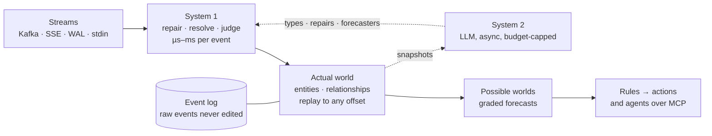

<p align="center">
  <picture>
    <source media="(prefers-color-scheme: dark)" srcset="docs/assets/banner-dark.svg">
    
  </picture>
</p>

<p align="center">
  
  
  
  
</p>

<p align="center"><b>Point it at an event stream you have never seen. In minutes, watch a living model of the world behind it form: what is true now, what is probably coming, and what to do about it.</b></p>

> [!NOTE]
> **Status: an experiment, pre-alpha. Nothing runs yet.** This README describes what we are building and the roadmap below says exactly where we are. Opinions are held lightly.

---

## The idea

Every organization already describes itself in streams: orders, shipments, edits, sensor readings, database writes. Almost nobody sees them as a whole, because turning a stream into a model of the business has always meant a schema project and a data team.

Stream2Worlds (`s2w`) skips that step. A stream is many entities' lives interleaved, every cart, customer and flight emitting events on its own schedule. `s2w` untangles it into a **world**: typed entities, relationships and state, rebuilt from the log so you can scrub it back to any moment. Then it forecasts what each entity does next, draws those forecasts as **possible worlds**, and grades every one against what actually happens.

A **possible world** here is one sampled future of the world, rolled forward from the present state. A forecast is a question asked across many such samples, recorded before the outcome and graded after it. (Probabilistic databases use the same phrase for uncertainty about the *present*; `s2w` borrows their Monte Carlo semantics and points them at the future. See [research 0001](research/0001-prior-art.md#q2-possible-worlds-as-a-term).)

## What you'll see

- **One command, no configuration.** `s2w watch <stream>` and raw events start flowing.
- **A world assembling itself.** Ids become entities, entities get types and names, the graph tidies itself as it learns.
- **It is not just remembering.** Rename every field to `f1…f17`, hash every id, and it still works out that the stream is air traffic.
- **Possible worlds.** Forecasts appear as dashed ghosts with probabilities, then turn solid or shatter when reality arrives, and the scorecard ticks.
- **Time travel.** The same scrubber replays the past exactly and imagines the future probabilistically.
- **Ask it from your agent.** Claude, Codex or any MCP client can query the world, ask for forecasts with their track records, and propose rules.

## How it works

Two systems over one log. **System 1** runs on every event in microseconds to milliseconds: rules, embeddings, and fast decision models such as Jev. **System 2** runs in the background in seconds: an LLM that reads snapshots of the world, proposes types, repairs and forecasters, and teaches System 1. System 2 never sits in the stream, which is the lesson from this project's predecessor.



| Principle | What it means |
|---|---|
| **The world is a replay of the log** | Entities and state are a projection, so any moment can be replayed, both as the system knew it then and as it understands it now. |
| **Repairs happen in the open** | Messy streams get aliases, links and type mappings as events of their own, with a confidence and a source. Nothing raw is ever edited, and any repair can be revoked. |
| **Reality grades every forecast** | A forecast is an immutable record with a horizon. Its outcome is scored separately, so every forecaster carries a public track record. Questions are registered with a cutoff, a horizon, outcome sources and baselines, the same shape as the [contract](docs/evaluation-contract.md) `s2w` was evaluated under before any code was written. |
| **If this, then that, across worlds** | One small language for queries, subscriptions and rules that read the world or a forecast and act through plugins. |
| **Agents are first-class clients** | A read-only MCP server exposes the world, forecasts, evidence and a ranked attention feed. The dashboard is where people see what agents saw and did. |

## Planned interface

```bash
# a public stream, no key needed
s2w watch https://stream.wikimedia.org/v2/stream/recentchange

# your Kafka topic: reads by partition assignment, never joins a consumer group, commits nothing
s2w watch kafka://localhost:9092/orders --lookback 2h

# anything you can already consume
kcat -C -b broker:9092 -t orders | s2w watch -

# then ask it from your coding agent
claude mcp add s2w -- s2w mcp
```

Local by default: nothing leaves your machine unless you approve an export manifest.

## Evaluation

A forecast you cannot check is an opinion. `s2w` grades its own predictions against what the stream later shows, and it grades itself the same way.

| What is graded | Against what | When |
|---|---|---|
| **Every forecast**, from any predictor: a rule, embeddings, a decision model such as Jev, an LLM | The outcome the stream later reports, and matched baselines: the base rate, a simple-features model, and any reference model you name | Continuously, once the forecast ledger lands (gate 4) |
| **Every judgment**: System 1 verdicts and System 2's proposed types, merges and repairs | Your accept or reject, and later evidence (a merge that later splits counts as a false merge) | After the first slice |
| **`s2w` itself** | A [pre-registered contract](docs/evaluation-contract.md), written before any code: the question, the eligible events, the baselines and the pass thresholds | Gates 3 and 4 |

Stream outcomes are awkward to grade, and the ledger is built around that:

- **Outcomes arrive late.** Each question fixes a deadline for deciding its outcome. Anything learned after that deadline is recorded as an audit and never rewrites the label.
- **Some outcomes are never observable.** A deleted page or an unrecoverable gap in the stream makes the outcome censored, not wrong. The evaluator, not the predictor, decides what is censored, and every result carries a worst-case check: would it survive if every censored case had gone against it?
- **Forecasts cannot be rewritten.** A forecast is fixed when it is issued. Replays, repairs and restarts never change it, and pruning a branch from the view never removes it from the score.
- **Abstaining can't fake skill.** A predictor may decline to answer; its abstentions are scored as base-rate guesses, so declining everything earns exactly zero skill, and how often it really answered is published beside its score.

Each predictor's record (graded count, skill over the base rate, calibration) is what `forecast.ask` returns alongside a probability, and what the System 1 router will use to pick an engine. `s2w` is not a general LLM eval framework. It grades forecasts and judgments against a live stream, the part existing eval tools do not cover.

## Roadmap

The first slice is four gates and a launch, each able to fail honestly. A runnable demo on live data ends every sprint.

- [x] **Gate 1 — the evaluation contract.** [Signed 2026-09-27](docs/evaluation-contract.md) after five review rounds. The question, how outcomes are labelled, the baselines to beat, and pass thresholds, written before any code.
- [ ] **Gate 2 — the local harness.** Rust workspace, two sources, the log, the pure fold with golden replay, an evidence view, read-only MCP. The workspace skeleton and its fitness functions passed review on 2026-09-27. ([milestone](https://github.com/daveremy/stream2worlds/milestone/1) · [epic](https://github.com/daveremy/stream2worlds/issues/12))
- [ ] **Gate 3 — does System 2 earn its place?** Heuristics against heuristics plus System 2, on Wikipedia, an obfuscated copy, and a private stream. ([milestone](https://github.com/daveremy/stream2worlds/milestone/2) · [epic](https://github.com/daveremy/stream2worlds/issues/13))
- [ ] **Gate 4 — one forecast ledger.** One question, independent outcomes, matched baselines, skill and coverage reported. ([milestone](https://github.com/daveremy/stream2worlds/milestone/3) · [epic](https://github.com/daveremy/stream2worlds/issues/14))
- [ ] **Launch.** The split-screen demo, one install path, open source. ([milestone](https://github.com/daveremy/stream2worlds/milestone/4) · [epic](https://github.com/daveremy/stream2worlds/issues/15))

After the slice: the revert forecast re-run on non-English Wikipedias (the first measurement is English-only by choice; `s2w` itself is built for streams in any language), the full possible-worlds view, rules with dry-run actions, the ADS-B air-traffic demo, and sharing through an approved export manifest.

## Architecture, continuously

Good architecture from the first commit, paid down every sprint instead of in a someday cleanup:

- a **pure functional core** (events in, world out; time and randomness passed in) inside an imperative shell;
- **layers enforced by the build**: a per-crate dependency allowlist, replay determinism, and escape hatches (`unwrap`, `#[allow]`, `todo!`) denied by the compiler, checked on every PR;
- **every seam ships with two real implementations** in the first slice, so no abstraction is designed from a single case;
- an `AGENTS.md` in every crate, because most of the code will be written by coding agents.

Decisions live in [`docs/decisions/`](docs/decisions/).

## Technical architecture

What `s2w` is built on, and what is deliberately not built yet. **Building** means part of the first slice, in the gate named; **later** means after the first slice; **on trigger** means we switch only when the named measurement says so.

| Part | Choice | Status | Why, or what would change it |
|---|---|---|---|
| Language and delivery | Rust, one static binary | building (gate 2) | Small enough to drop into someone else's network; predictable memory, no GC pauses in the stream, good async I/O for many sources. |
| Workspace | `s2w-model` ← `s2w-core`, `s2w-log`, `s2w-sources`, `s2w-system1`, `s2w-system2` ← `s2w-app` ← `s2w`; `s2w-testkit` for tests | building (gate 2) | The workspace is the architecture: core and model do no I/O, adapters depend only on the model, the app composes them. |
| Serialization and errors | `serde`, `serde_json`, `thiserror` | building (gate 2) | The model's only dependencies; typed errors in libraries. |
| Fitness functions | `cargo xtask check` (`toml`, `serde_json`) | building (gate 2) | Dependency allowlist by identity, this table by exact name, AGENTS.md in every crate, workspace lint inheritance. |
| Sources | Wikipedia EventStreams (SSE), Kafka by partition assignment (never a consumer group, never commits), stdin NDJSON | building (gate 2) | Two real sources plus a free third, so the source seam is not designed from one case. |
| Event log | Append-only local log with source cursors and provenance; storage format chosen in a gate-2 decision record | building (gate 2) | Raw events are never edited; the world is a replay of the log. |
| World computation | Pure fold over the log; each forecast world recomputed from a snapshot | building (gate 2) | Simplest thing that replays deterministically. |
| Incremental engine | [Differential Dataflow](https://github.com/TimelyDataflow/differential-dataflow) first (7 direct dependencies, no runtime), [Feldera's DBSP](https://github.com/feldera/feldera) runner-up; world branch as a column | on trigger | Switch when forks × world size misses a 100 ms frame budget ([research 0003](research/0003-rust-substrate.md)). The predecessors used Differential Dataflow (worldcraft) and Timely (timely_worlds). |
| System 1 engines | Rules; local embeddings (can abstain) | building (gate 2–3) | Two engines behind one verdict/confidence/abstain trait. |
| System 1, decision models | TypeSafe's Jev and similar models, as a third engine behind the same trait | later | Nobody has measured Jev's latency, cost or accuracy on these questions; it joins through the bake-off, p50/p99 and accuracy per engine. |
| System 1 router | Each judgment names a latency budget; rule → embeddings → decision model | later | Needs more than one engine worth routing between. |
| System 2 | A hosted LLM API on a fixed budget; the client's own agent via MCP sampling, or a local model | building (gate 3) | Asynchronous, never in the stream. Two providers differ in latency, cost and where data goes. |
| Agent interface | Read-only MCP server; every CLI command has `--json` | building (gate 2) | Agents are first-class clients. Write access comes later, and never from a good track record alone. |
| Dashboard | Local web view (evidence table and graph first) | building (gate 2) | Ghosts, cones, scrub-past-now and live calibration come after the slice. |
| Forecast ledger | Immutable issuances plus appended outcome observations | building (gate 4) | Scored against base rate and Wikimedia's revert-risk model. See the [evaluation contract](docs/evaluation-contract.md). |
| Actions | WebAssembly plugins with host-enforced egress, secrets and limits | later | Customers add actions without touching the core. |

This table is checked, not just maintained: `cargo xtask check` fails when a workspace crate is missing from this section, or when an external dependency does not name a row here ([decision 0001](docs/decisions/0001-workspace-layers.md)).

## Related work

Every part of `s2w` exists somewhere. As of 2026-09-27 we found no system that does all of it: discovering entity types, identity keys and relationships from a raw event stream, keeping the LLM off the event path, replaying the world from its log, and grading its own forecasts against the live stream. The full map, with citations, is [research 0001](research/0001-prior-art.md). The nearest neighbours:

- **[Graphiti](https://github.com/getzep/graphiti)** (Zep, [arXiv 2501.13956](https://arxiv.org/abs/2501.13956)) builds a temporal knowledge graph from a stream of episodes. It calls an LLM on every episode and resolves identity by name similarity. `s2w` calls its LLM on snapshots, compiles what it learns into rules that run without it, discovers identity keys from the data, replays deterministically from the log, and forecasts.
- **Object-centric process mining** discovers object types and their relationships from flat event logs, offline. The strongest method, [Rebmann, Rehse and van der Aa (BPM 2022)](https://doi.org/10.1007/978-3-031-16103-2_25), leans on attribute names; gate 3's obfuscated stream is the case where names carry nothing. `s2w`'s world maps onto the [OCEL 2.0](https://arxiv.org/abs/2403.01975) standard's objects and relationships.
- **Key discovery in databases**, such as [LLM-FK](https://arxiv.org/abs/2603.07278) and [Tursio](https://arxiv.org/abs/2603.04176), finds keys with statistics first and an LLM to adjudicate, on static tables.
- **Complex event forecasting**, such as [Wayeb](https://link.springer.com/article/10.1007/s00778-021-00698-x), issues and scores probabilistic forecasts on live streams, for patterns you write.
- **Wikimedia's [revert-risk model](https://meta.wikimedia.org/wiki/Machine_learning_models/Production/Language-agnostic_revert_risk)** already publishes a revert probability for every edit, live. Gate 4 uses it as the strong baseline. Its label has no time window; the gate-4 question asks about 30 minutes.

## Design and reviews

- [Research notes](research/): prior art, structure discovery without LLMs, the Rust substrate
- [Design document](docs/design/stream2worlds-design.html) (interactive; open it locally in a browser)
- Design critic passes: [round 1, Codex](docs/reviews/round1-codex.md) · [round 1, Claude](docs/reviews/round1-claude-critic.md) · [round 2, Codex](docs/reviews/round2-codex.md) · [round 2, Claude](docs/reviews/round2-claude-critic.md)
- Evaluation contract reviews: [1](docs/reviews/gate1-contract-round1-codex.md) · [2](docs/reviews/gate1-contract-round2-codex.md) · [3](docs/reviews/gate1-contract-round3-codex.md) · [4](docs/reviews/gate1-contract-round4-codex.md) · [5, sign](docs/reviews/gate1-contract-round5-codex.md)
- Workspace skeleton reviews: [1](docs/reviews/skeleton-round1-codex.md) · [2](docs/reviews/skeleton-round2-codex.md) · [3](docs/reviews/skeleton-round3-codex.md) · [4, approved](docs/reviews/skeleton-round4-codex.md)
- [Decision records](docs/decisions/)

## Where it came from

It started at EventStore with a wish: switch on predictions for an event store the way you switch on a projection. That became [PredictStream](https://predictstream.ai), a pipeline of pluggable agents that proved the idea and hit a wall: LLMs in the stream were too slow. The most interesting thing it produced was not a prediction but a model of the world behind the events, which three Rust prototypes (worldcraft, timely_worlds, strema) then explored. Stream2Worlds puts them together, now that fast decision models make System 1 possible.

## License

To be chosen at launch; it will be permissive (MIT or Apache-2.0).
