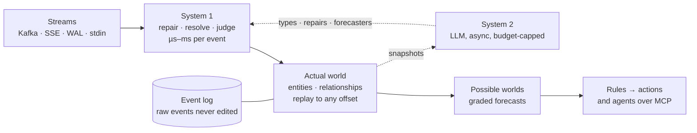

<p align="center">
  <picture>
    <source media="(prefers-color-scheme: dark)" srcset="docs/assets/banner-dark.svg">
    
  </picture>
</p>

<p align="center">
  
  
  
  
</p>

<p align="center"><b>Point <code>s2w</code> at an event stream you have never seen and watch a model of the world behind it form. Every forecast it makes is graded against what the stream shows next. The LLM never touches an event.</b></p>

> [!NOTE]
> **A research project, pre-alpha.** Each gate is a pre-registered question that can fail, and every result, negative ones included, is published. `s2w watch` runs today against Wikipedia, Kafka, generic Server-Sent Events streams and stdin, streaming into a durable log that resumes across restarts; `s2w mcp` exposes five read-only query tools over stdio (an empty world until the live bridge is wired into the CLI). Gate 1 (the evaluation contract) is signed; gate 2 (the harness) has its workspace, its fitness functions, the append-only event log, three sources, the pure fold with golden replay, a world query API and read-only MCP; the live bridge from the log through two System 1 engines into query state is built as a library, and wiring it into a serving command ([#10](https://github.com/daveremy/stream2worlds/issues/10)) and the evidence view are next. The [roadmap](#roadmap) says exactly where we are. Opinions are held lightly.

## Latest

*Updated at the end of every sprint. The full story is in the [changelog](CHANGELOG.md).*

- **A second source: Kafka, by partition assignment.** `s2w watch kafka://broker/topic` reads every partition itself, joins no consumer group, commits no offsets, and resumes each partition from its own stored offset. [Decision 0007](docs/decisions/0007-kafka-client.md) · [#7](https://github.com/daveremy/stream2worlds/issues/7)
- **Sources are transports; streams are presets.** The registry resolves `s2w watch <uri>` by scheme — `kafka://`, `sse://`/`https://`/`http://`, `-` for stdin — and `wikipedia` is now a preset over the generic SSE adapter, not its own module. [Decision 0008](docs/decisions/0008-generic-sse-adapter.md) · [#49](https://github.com/daveremy/stream2worlds/issues/49)
- **`--json` on the CLI.** `s2w --version --json`, `--help --json` and top-level errors print JSON for scripts; `watch --json` is next. [#53](https://github.com/daveremy/stream2worlds/issues/53)
- **A read-only MCP server mirrors the query API.** `s2w mcp` serves the same world-query tools over stdio for MCP clients (`claude mcp add s2w -- s2w mcp`). [Decision 0009](docs/decisions/0009-mcp-server.md) · [#52](https://github.com/daveremy/stream2worlds/issues/52)
- **`s2w watch wikipedia` runs for real, and restarts lose nothing.** A 38.5-minute live run stored 47,282 English Wikipedia edits with 0 duplicates and 0 gaps across a restart, resuming from the stored cursor; 300 forced redeliveries were collapsed by the log. [#29](https://github.com/daveremy/stream2worlds/issues/29) · [#25](https://github.com/daveremy/stream2worlds/issues/25)
- **The world can be asked at any offset.** `s2w-app` serves `/world?at=<offset>&lod=type|entity&focus=&hops=`, one SSE delta per offset, `/branches`, `/diff`, `/entity/:id/history` and `/time` over the folded world; entities past the in-degree cap come back as one hub node. Main branch only for now. [Decision 0006](docs/decisions/0006-world-query-api.md)
- **The fold is pure and its replay is checked in CI.** An entity id is assigned once and never reused; a merge aliases and a revoke splits. `cargo xtask check` folds the golden log twice and from every saved prefix, and fails on a single differing byte. [Decision 0005](docs/decisions/0005-pure-fold.md)
- **The first slice has a stated scale envelope.** One process, 1,000 events/s, 10^6 live entities in 1 GB, 20 forks under 100 ms; `synchronous=FULL` everywhere, throughput from group commit. Not a distributed system, by decision. [Decision 0004](docs/decisions/0004-scale-envelope.md)
- **In progress:** in-crate fitness functions ([#44](https://github.com/daveremy/stream2worlds/issues/44)) and the evidence view ([#10](https://github.com/daveremy/stream2worlds/issues/10)).

---

## The idea

Every organization already describes itself in streams: orders, shipments, edits, sensor readings, database writes. Almost nobody sees them as a whole, because turning a stream into a model of the business has always meant a schema project and a data team.

Stream2Worlds (`s2w`) skips that step. A stream is many entities' lives interleaved: every cart, customer and flight emitting events on its own schedule. `s2w` untangles it into a **world**, typed entities, relationships and state, rebuilt from the log so you can scrub it back to any moment. Then it forecasts what each entity does next, draws those forecasts as **possible worlds**, and grades every one against what actually happens.

A **possible world** here is one sampled future of the world, rolled forward from the present state. A forecast is a question asked across many such samples, recorded before the outcome and graded after it. (Probabilistic databases use the same phrase for uncertainty about the *present*; `s2w` borrows their Monte Carlo semantics and points them at the future. See [research 0001](research/0001-prior-art.md#q2-possible-worlds-as-a-term).)

## What the demo will show

None of this exists yet. It is the demo the first slice builds toward, and each line names the gate that has to pass first.

- **One command, no configuration.** `s2w watch <stream>` and raw events start flowing. (gate 2)
- **A world assembling itself.** Ids become entities, entities get types and names, the graph tidies itself as it learns. (gate 2 for the evidence view, gate 3 for the learning)
- **Structure, not memorized names.** Gate 3 feeds `s2w` a copy of a stream with every field renamed to `f1…f17` and every id hashed. It has to recover the entities and their keys anyway, and it is scored against heuristics and against an LLM shown raw events.
- **Possible worlds.** Forecasts appear as dashed ghosts with probabilities, then turn solid or shatter when reality arrives, and the scorecard ticks. (the ledger in gate 4; the view after the slice)
- **Time travel.** One scrubber replays the past exactly and imagines the future probabilistically. (gate 2 for replay; the future view after the slice)
- **Ask it from your agent.** Claude, Codex or any MCP client can query the world, ask for forecasts with their track records, and propose rules. (read-only MCP in gate 2)

## How it works

Two systems over one log. **System 1** runs on every event in microseconds to milliseconds: rules, embeddings, and fast decision models such as Jev. **System 2** runs in the background in seconds: an LLM that reads snapshots of the world, proposes types, repairs and forecasters, and teaches System 1. System 2 never sits in the stream. That is the lesson from this project's predecessor, which put the LLM on the event path and was too slow.



| Principle | What it means |
|---|---|
| **The world is a replay of the log** | Entities and state are a projection, so any moment can be replayed, both as the system knew it then and as it understands it now. |
| **Repairs happen in the open** | Messy streams get aliases, links and type mappings as events of their own, with a confidence and a source. Nothing raw is ever edited, and any repair can be revoked. |
| **Reality grades every forecast** | A forecast is an immutable record with a horizon. Its outcome is scored separately, so every forecaster carries a public track record. Questions are registered with a cutoff, a horizon, outcome sources and baselines, the same shape as the [contract](docs/evaluation-contract.md) `s2w` was evaluated under before any code was written. |
| **If this, then that, across worlds** | One small language for queries, subscriptions and rules that read the world or a forecast and act through plugins. |
| **Agents are first-class clients** | A read-only MCP server exposes the world, forecasts, evidence and a ranked attention feed. The dashboard is where people see what agents saw and did. |

## Running today

```bash
# stream Wikipedia page changes into a local SQLite event log (default ./s2w-data)
s2w watch wikipedia --log-dir ./s2w-data

# replay history first; only for a log that has no stored cursor yet
s2w watch wikipedia --since 2026-09-27T00:00:00Z --log-dir ./fresh-dir

# your Kafka topic: reads by partition assignment, never joins a consumer group, commits nothing
s2w watch kafka://localhost:9092/orders --log-dir ./s2w-data

# any Server-Sent Events stream over https — ids are stored verbatim, no --since
s2w watch https://stream.example.org/v2/recent --log-dir ./s2w-data

# newline-delimited JSON already on your machine
kcat -C -b broker:9092 -t orders | s2w watch - --log-dir ./s2w-data
```

Stop it with Ctrl-C. Run it again on the same `--log-dir` and it resumes from the stored cursor (Wikipedia's `Last-Event-ID`, a generic SSE stream's `id:`, or a Kafka partition's last offset), not from now. Events redelivered on resume are collapsed by the log, which dedupes on source plus payload content, so two distinct events sharing a millisecond are both kept. Passing `--since` to a log that already has a cursor is a usage error; a generic SSE or stdin source never accepts `--since` at all.

If you run Kafka: `s2w` is a read-only observer of your topic. It assigns partitions itself, joins no consumer group, commits no offsets, and keeps its own cursors in its local log ([decision 0007](docs/decisions/0007-kafka-client.md)).

To connect an MCP client, configure it to launch `s2w mcp` (for example, `claude mcp add s2w -- s2w mcp`). It exposes `world_view`, `world_diff`, `entity_history`, `branches`, and `time`; each returns the same JSON as its HTTP query route. The CLI currently serves an empty world: the bridge from the stored event log to the query timeline exists as a library ([decision 0011](docs/decisions/0011-system1-bridge.md)) but no command runs it yet ([#10](https://github.com/daveremy/stream2worlds/issues/10)). Stdout carries only MCP messages. See [decision 0009](docs/decisions/0009-mcp-server.md).

## Planned interface

This is the target shape. `s2w watch wikipedia`, `s2w watch kafka://…` and `s2w mcp` above run
today. Still to build: reading only some partitions or sampling entities by key on a busier
Kafka topic.

```bash
# for a busier topic, read some partitions or sample entities by key
s2w watch kafka://localhost:9092/orders --partitions 0,1 --sample 1/4

# then ask it from your coding agent
claude mcp add s2w -- s2w mcp
```

`s2w` targets about 1,000 events/s on a laptop. Local by default: nothing leaves your machine unless you approve an export manifest.

## Evaluation

A forecast you cannot check is an opinion. `s2w` grades its own predictions against what the stream later shows, and it grades itself the same way.

| What is graded | Against what | When |
|---|---|---|
| **Every forecast**, from any predictor: a rule, embeddings, a decision model such as Jev, an LLM | The outcome the stream later reports, and matched baselines: the base rate, a simple-features model, and any reference model you name | Continuously, once the forecast ledger lands (gate 4) |
| **Every judgment**: System 1 verdicts and System 2's proposed types, merges and repairs | Your accept or reject, and later evidence (a merge that later splits counts as a false merge) | After the first slice |
| **`s2w` itself** | A [pre-registered contract](docs/evaluation-contract.md), written before any code: the question, the eligible events, the baselines and the pass thresholds | Gates 3 and 4 |

Stream outcomes are awkward to grade, and the ledger is built around that:

- **Outcomes arrive late.** Each question fixes a deadline for deciding its outcome. Anything learned after that deadline is recorded as an audit and never rewrites the label.
- **Some outcomes are never observable.** A deleted page or an unrecoverable gap in the stream makes the outcome censored, not wrong. The evaluator, not the predictor, decides what is censored, and every result carries a worst-case check: would it survive if every censored case had gone against it?
- **Forecasts cannot be rewritten.** A forecast is fixed when it is issued. Replays, repairs and restarts never change it, and pruning a branch from the view never removes it from the score.
- **Abstaining can't fake skill.** A predictor may decline to answer; its abstentions are scored as base-rate guesses, so declining everything earns exactly zero skill, and how often it really answered is published beside its score.

Each predictor's record (graded count, skill over the base rate, calibration) is what `forecast.ask` returns alongside a probability, and what the System 1 router will use to pick an engine. `s2w` is not a general LLM eval framework. It grades forecasts and judgments against a live stream, the part existing eval tools do not cover.

**The first question, with its numbers.** Gate 4 asks, for each human edit to an English Wikipedia article: will it be reverted within 30 minutes? A 30-minute pilot on 2026-09-27 ([research 0004](research/0004-revert-pilot.md)) measured 1,854 eligible edits, a 3.8% base rate, and ROC AUC 0.888 for Wikimedia's own revert-risk model on that question. One Sunday-morning window, so these are orders of magnitude, not the test. Wikimedia's model is reported beside `s2w`'s score, not required to be beaten: the gate asks for skill over the base rate and over a simple-features model, and calibration ([contract A9](docs/evaluation-contract.md#a9-gate-4-pass-thresholds-dave-2026-09-27-report-b2-dont-require-it)).

## Roadmap

The first slice is four gates and a launch, each able to fail honestly. A runnable demo on live data ends every sprint.

- [x] **Gate 1 — the evaluation contract.** [Signed 2026-09-27](docs/evaluation-contract.md) after five review rounds. The question, how outcomes are labelled, the baselines to beat, and pass thresholds, written before any code.
- [ ] **Gate 2 — the local harness.** Rust workspace, three sources, the log, the pure fold with golden replay, an evidence view, read-only MCP. The workspace skeleton, fitness functions, the append-only event log, the Wikipedia/Kafka/generic-SSE sources, the pure fold with golden replay and the world query API (actual world only) are built; read-only MCP over stdio is also built; the live bridge (log → System 1 → query state) is built as a library; wiring it into a serving command and the evidence view are still to build. ([milestone](https://github.com/daveremy/stream2worlds/milestone/1) · [epic](https://github.com/daveremy/stream2worlds/issues/12))
- [ ] **Gate 3 — does System 2 earn its place?** Heuristics against heuristics plus System 2, on Wikipedia, an obfuscated copy, and a private stream. ([milestone](https://github.com/daveremy/stream2worlds/milestone/2) · [epic](https://github.com/daveremy/stream2worlds/issues/13))
- [ ] **Gate 4 — one forecast ledger.** One question, independent outcomes, matched baselines, skill and coverage reported. ([milestone](https://github.com/daveremy/stream2worlds/milestone/3) · [epic](https://github.com/daveremy/stream2worlds/issues/14))
- [ ] **Launch.** The split-screen demo, one install path, open source. ([milestone](https://github.com/daveremy/stream2worlds/milestone/4) · [epic](https://github.com/daveremy/stream2worlds/issues/15))

After the slice: the revert forecast re-run on non-English Wikipedias (the first measurement is English-only by choice; `s2w` itself is built for streams in any language), the full possible-worlds view, a 3D explorer for moving through a world and its possible futures, rules with dry-run actions, the ADS-B air-traffic demo, and sharing through an approved export manifest.

## Architecture, continuously

Good architecture from the first commit, paid down every sprint instead of in a someday cleanup:

- a **pure functional core** (events in, world out; time and randomness passed in) inside an imperative shell;
- **layers enforced by the build**: a per-crate dependency allowlist, replay determinism, and escape hatches (`unwrap`, `#[allow]`, `todo!`) denied by the compiler, checked on every PR;
- **every seam ships with two real implementations** in the first slice, so no abstraction is designed from a single case;
- an `AGENTS.md` in every crate, because most of the code will be written by coding agents.

Decisions live in [`docs/decisions/`](docs/decisions/).

## Technical architecture

What `s2w` is built on, and what is deliberately not built yet. **Building** means part of the first slice, in the gate named; **later** means after the first slice; **on trigger** means we switch only when the named measurement says so.

| Part | Choice | Status | Why, or what would change it |
|---|---|---|---|
| Language and delivery | Rust, one static binary | building (gate 2) | Small enough to drop into someone else's network; predictable memory, no GC pauses in the stream, good async I/O for many sources. |
| Workspace | `s2w-model` ← `s2w-core`, `s2w-log`, `s2w-sources`, `s2w-system1`, `s2w-system2` ← `s2w-app` ← `s2w`; `s2w-testkit` for tests | building (gate 2) | The workspace is the architecture: core and model do no I/O, adapters depend only on the model, the app composes them. |
| Serialization and errors | `serde`, `serde_json`, `thiserror` | building (gate 2) | The model's dependencies, plus `serde` in the core so a world serializes; typed errors in libraries. |
| Fitness functions | `cargo xtask check` (`toml`, `serde_json`, `syn`, `proc-macro2`) | building (gate 2) | Dependency allowlist by identity, this table by exact name, AGENTS.md in every crate, workspace lint inheritance, report-only module sizes with a blocking exemption-growth ratchet, and golden replay: the golden log folds to the same bytes twice, from any serialized prefix, and matches the human-owned snapshot. |
| Property & snapshot testing | `proptest`, `insta` | building (gate 2) | Property tests check the fold's entity identity against an independent reference model and resume from any serialized prefix; `insta` pins the fold's output shape for human review. Test-only dependencies of `s2w-core`. |
| Licence and advisory gate | `cargo deny check licenses advisories bans` | built (gate 2) | Dependencies must stay permissive: MIT, Apache-2.0, ISC, BSD-3-Clause or Unicode-3.0, plus two scoped exceptions (`foldhash` Zlib, never compiled for our targets; `webpki-root-certs` CDLA-Permissive-2.0, the Mozilla CA bundle), per [research 0003 §8d](research/0003-rust-substrate.md#8d-licences). RustSec advisories must not silently ship. |
| Sources | A `Source` registry resolved by URI scheme ([decision 0008](docs/decisions/0008-generic-sse-adapter.md)): Kafka by partition assignment via `rskafka` (never a consumer group, never commits; [decision 0007](docs/decisions/0007-kafka-client.md)), a generic SSE adapter via `reqwest`/`tokio`/`tokio-stream` with `wikipedia` as a preset over it ([decision 0003](docs/decisions/0003-wikipedia-sse-client.md)), and stdin NDJSON | built (gate 2) | Three real transports plus a preset, so the source seam is not designed from one case. |
| Scale | One process on a 4-core, 16 GB laptop: 1,000 events/s, 10^6 live entities in 1 GB, 20 possible-world forks in under 100 ms | target (gate 2) | Targets until the scale fitness function measures them. Not a distributed system: bigger topics use `--partitions` or `--sample 1/N by key` ([decision 0004](docs/decisions/0004-scale-envelope.md), [research 0006](research/0006-scaling.md)). |
| Event log | Append-only SQLite log (`rusqlite`, WAL, synchronous FULL) with source cursors and provenance | built (gate 2) | Each append stores its event and advances its source cursor in one transaction; raw events are never edited. |
| World computation | Pure fold over the log; each forecast world recomputed from a snapshot | built (gate 2) | Simplest thing that replays deterministically. Ids are assigned once and never reused; merges alias, revokes split ([decision 0005](docs/decisions/0005-pure-fold.md)). Forecast worlds wait for branches. |
| World query API | HTTP over the folded world in `s2w-app` (`axum`, SSE deltas; `tower` in tests): `/world` at any offset and level of detail, `/events`, `/branches`, `/diff`, `/entity/:id/history`, `/time` ([decision 0006](docs/decisions/0006-world-query-api.md)) | built (gate 2) | One contract for the web view, `--json` and MCP, and later the 3D explorer. Serves the actual world only until branches exist (`branch=` other than actual and `lod=cluster` answer 501); `s2w mcp` exposes its five read tools over stdio; the HTTP listener awaits the evidence view ([#10](https://github.com/daveremy/stream2worlds/issues/10)). |
| Incremental engine | [Differential Dataflow](https://github.com/TimelyDataflow/differential-dataflow) first (7 direct dependencies, no runtime), [Feldera's DBSP](https://github.com/feldera/feldera) runner-up; world branch as a column | on trigger | Switch when forks × world size misses a 100 ms frame budget ([research 0003](research/0003-rust-substrate.md)). The predecessors used Differential Dataflow (worldcraft) and Timely (timely_worlds). |
| System 1 engines | Rules; JSON claims; local embeddings (next) | building (gate 2–3) | Two engines ship behind one verdict/confidence/abstain trait: Wikimedia page-change rules and JSON claims (a payload that already is a claim). Local embeddings are next; they wait on persisted verdicts, because a model file is an input the log does not capture ([decision 0011](docs/decisions/0011-system1-bridge.md)). |
| System 1, decision models | TypeSafe's Jev and similar models, as a third engine behind the same trait | later | Nobody has measured Jev's latency, cost or accuracy on these questions; it joins through the bake-off, p50/p99 and accuracy per engine. |
| System 1 router | Each judgment names a latency budget; rule → embeddings → decision model | later | Needs more than one engine worth routing between. |
| System 2 | A hosted LLM API on a fixed budget; the client's own agent via MCP sampling, or a local model | building (gate 3) | Asynchronous, never in the stream. Two providers differ in latency, cost and where data goes. |
| Read-only MCP server | `s2w mcp` over stdio using `rmcp` `=3.4.1`; five tools share the query API ([decision 0009](docs/decisions/0009-mcp-server.md)) | built (gate 2) | Read-only annotations, identical JSON responses, empty world until the live event-log bridge is wired into a command ([#10](https://github.com/daveremy/stream2worlds/issues/10)). No HTTP MCP transport yet. |
| Dashboard | Local web view (evidence table and graph first) | building (gate 2) | Ghosts, cones, scrub-past-now and live calibration come after the slice, then a 3D world explorer built on three.js ([#21](https://github.com/daveremy/stream2worlds/issues/21), [research 0005](research/0005-3d-exploration.md)): 3D for exploring, linked 2D panels for reading. The view reads the world through the same query interface as MCP, so the renderer can change without touching the core. |
| Forecast ledger | Immutable issuances plus appended outcome observations | building (gate 4) | Scored against base rate and Wikimedia's revert-risk model. See the [evaluation contract](docs/evaluation-contract.md). |
| Actions | WebAssembly plugins with host-enforced egress, secrets and limits | later | Customers add actions without touching the core. |

This table is checked, not just maintained: `cargo xtask check` fails when a workspace crate is missing from this section, or when an external dependency does not name a row here ([decision 0001](docs/decisions/0001-workspace-layers.md)).

## Building

Build with `cargo build --release` and run `target/release/s2w watch wikipedia`. The gates that CI runs on every pull request:

```bash
cargo fmt --all --check
cargo clippy --workspace --all-targets -- -D warnings
cargo test --workspace
cargo xtask check
cargo deny check licenses advisories bans
```

Rust 1.98 or later. `cargo xtask check` is the fitness-function suite described above; when it fails, its message says what to change. The separate `cargo deny` gate rejects unapproved dependency licences and RustSec advisories.

## Related work

Every part of `s2w` exists somewhere. As of 2026-09-27 we found no system that does all of it: discovering entity types, identity keys and relationships from a raw event stream, keeping the LLM off the event path, replaying the world from its log, and grading its own forecasts against the live stream. The full map, with citations, is [research 0001](research/0001-prior-art.md). The nearest neighbours:

- **[Graphiti](https://github.com/getzep/graphiti)** (Zep, [arXiv 2501.13956](https://arxiv.org/abs/2501.13956)) builds a temporal knowledge graph from a stream of episodes. It calls an LLM on every episode and resolves identity by name similarity. `s2w` calls its LLM on snapshots, compiles what it learns into rules that run without it, discovers identity keys from the data, replays deterministically from the log, and forecasts.
- **Object-centric process mining** discovers object types and their relationships from flat event logs, offline. The strongest method, [Rebmann, Rehse and van der Aa (BPM 2022)](https://doi.org/10.1007/978-3-031-16103-2_25), leans on attribute names; gate 3's obfuscated stream is the case where names carry nothing. `s2w`'s world maps onto the [OCEL 2.0](https://arxiv.org/abs/2403.01975) standard's objects and relationships.
- **Key discovery in databases**, such as [LLM-FK](https://arxiv.org/abs/2603.07278) and [Tursio](https://arxiv.org/abs/2603.04176), finds keys with statistics first and an LLM to adjudicate, on static tables.
- **Complex event forecasting**, such as [Wayeb](https://link.springer.com/article/10.1007/s00778-021-00698-x), issues and scores probabilistic forecasts on live streams, for patterns you write.
- **Wikimedia's [revert-risk model](https://meta.wikimedia.org/wiki/Machine_learning_models/Production/Language-agnostic_revert_risk)** already publishes a revert probability for every edit, live. Gate 4 uses it as the strong baseline. Its label has no time window; the gate-4 question asks about 30 minutes.

## Design and reviews

- [Changelog](CHANGELOG.md): the development arc, sprint by sprint
- [Research notes](research/): prior art, structure discovery without LLMs, the Rust substrate, the revert pilot
- [Design document](docs/design/stream2worlds-design.html) (interactive; open it locally in a browser)
- Design critic passes: [round 1, Codex](docs/reviews/round1-codex.md) · [round 1, Claude](docs/reviews/round1-claude-critic.md) · [round 2, Codex](docs/reviews/round2-codex.md) · [round 2, Claude](docs/reviews/round2-claude-critic.md)
- Evaluation contract reviews: [1](docs/reviews/gate1-contract-round1-codex.md) · [2](docs/reviews/gate1-contract-round2-codex.md) · [3](docs/reviews/gate1-contract-round3-codex.md) · [4](docs/reviews/gate1-contract-round4-codex.md) · [5, sign](docs/reviews/gate1-contract-round5-codex.md)
- Workspace skeleton reviews: [1](docs/reviews/skeleton-round1-codex.md) · [2](docs/reviews/skeleton-round2-codex.md) · [3](docs/reviews/skeleton-round3-codex.md) · [4, approved](docs/reviews/skeleton-round4-codex.md)
- [Decision records](docs/decisions/)

## Where it came from

It started at EventStore with a wish: switch on predictions for an event store the way you switch on a projection. That became [PredictStream](https://predictstream.ai), a pipeline of pluggable agents that proved the idea and hit a wall: LLMs in the stream were too slow. The most interesting thing it produced was not a prediction but a model of the world behind the events, which three Rust prototypes (worldcraft, timely_worlds, strema) then explored. Stream2Worlds puts them together, now that fast decision models make System 1 possible.

## License

To be chosen at launch; it will be permissive. The workspace manifest already declares `MIT OR Apache-2.0`.
