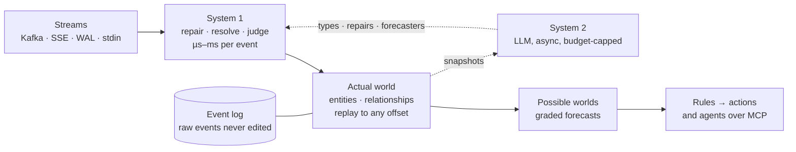

<p align="center">
  <picture>
    <source media="(prefers-color-scheme: dark)" srcset="docs/assets/banner-dark.svg">
    
  </picture>
</p>

<p align="center">
  
  
  
  
</p>

<p align="center"><b>Point it at an event stream you have never seen. In minutes, watch a living model of the world behind it form: what is true now, what is probably coming, and what to do about it.</b></p>

> [!NOTE]
> **Status: an experiment, pre-alpha. Nothing runs yet.** This README describes what we are building and the roadmap below says exactly where we are. Opinions are held lightly.

---

## The idea

Every organization already describes itself in streams: orders, shipments, edits, sensor readings, database writes. Almost nobody sees them as a whole, because turning a stream into a model of the business has always meant a schema project and a data team.

Stream2Worlds (`s2w`) skips that step. A stream is many entities' lives interleaved, every cart, customer and flight emitting events on its own schedule. `s2w` untangles it into a **world**: typed entities, relationships and state, rebuilt from the log so you can scrub it back to any moment. Then it forecasts what each entity does next, draws those forecasts as **possible worlds**, and grades every one against what actually happens.

## What you'll see

- **One command, no configuration.** `s2w watch <stream>` and raw events start flowing.
- **A world assembling itself.** Ids become entities, entities get types and names, the graph tidies itself as it learns.
- **It is not just remembering.** Rename every field to `f1…f17`, hash every id, and it still works out that the stream is air traffic.
- **Possible worlds.** Forecasts appear as dashed ghosts with probabilities, then turn solid or shatter when reality arrives, and the scorecard ticks.
- **Time travel.** The same scrubber replays the past exactly and imagines the future probabilistically.
- **Ask it from your agent.** Claude, Codex or any MCP client can query the world, ask for forecasts with their track records, and propose rules.

## How it works

Two systems over one log. **System 1** runs on every event in microseconds to milliseconds: rules, embeddings, and fast decision models such as Jev. **System 2** runs in the background in seconds: an LLM that reads snapshots of the world, proposes types, repairs and forecasters, and teaches System 1. System 2 never sits in the stream, which is the lesson from this project's predecessor.



| Principle | What it means |
|---|---|
| **The world is a replay of the log** | Entities and state are a projection, so any moment can be replayed, both as the system knew it then and as it understands it now. |
| **Repairs happen in the open** | Messy streams get aliases, links and type mappings as events of their own, with a confidence and a source. Nothing raw is ever edited, and any repair can be revoked. |
| **Reality grades every forecast** | A forecast is an immutable record with a horizon. Its outcome is scored separately, so every forecaster carries a public track record. |
| **If this, then that, across worlds** | One small language for queries, subscriptions and rules that read the world or a forecast and act through plugins. |
| **Agents are first-class clients** | A read-only MCP server exposes the world, forecasts, evidence and a ranked attention feed. The dashboard is where people see what agents saw and did. |

## Planned interface

```bash
# a public stream, no key needed
s2w watch https://stream.wikimedia.org/v2/stream/recentchange

# your Kafka topic: reads by partition assignment, never joins a consumer group, commits nothing
s2w watch kafka://localhost:9092/orders --lookback 2h

# anything you can already consume
kcat -C -b broker:9092 -t orders | s2w watch -

# then ask it from your coding agent
claude mcp add s2w -- s2w mcp
```

Local by default: nothing leaves your machine unless you approve an export manifest.

## Roadmap

The first slice is four gates and a launch, each able to fail honestly. A runnable demo on live data ends every sprint.

- [ ] **Gate 1 — the evaluation contract.** The question, how outcomes are labelled, the baselines to beat, and pass thresholds, written before any code.
- [ ] **Gate 2 — the local harness.** Rust workspace, two sources, the log, the pure fold with golden replay, an evidence view, read-only MCP.
- [ ] **Gate 3 — does System 2 earn its place?** Heuristics against heuristics plus System 2, on Wikipedia, an obfuscated copy, and a private stream.
- [ ] **Gate 4 — one forecast ledger.** One question, independent outcomes, matched baselines, skill and coverage reported.
- [ ] **Launch.** The split-screen demo, one install path, open source.

After the slice: the full possible-worlds view, rules with dry-run actions, the ADS-B air-traffic demo, and sharing through an approved export manifest.

## Architecture, continuously

Good architecture from the first commit, paid down every sprint instead of in a someday cleanup:

- a **pure functional core** (events in, world out; time and randomness passed in) inside an imperative shell;
- **layers enforced by the build**: a per-crate dependency allowlist, replay determinism, and a ratchet on escape hatches, checked on every PR;
- **every seam ships with two real implementations** in the first slice, so no abstraction is designed from a single case;
- an `AGENTS.md` in every crate, because most of the code will be written by coding agents.

Decisions live in [`docs/decisions/`](docs/decisions/).

## Design and reviews

- [Design document](docs/design/stream2worlds-design.html) (interactive; open it locally in a browser)
- Critic passes: [round 1, Codex](docs/reviews/round1-codex.md) · [round 1, Claude](docs/reviews/round1-claude-critic.md) · [round 2, Codex](docs/reviews/round2-codex.md) · [round 2, Claude](docs/reviews/round2-claude-critic.md)

## Where it came from

It started at EventStore with a wish: switch on predictions for an event store the way you switch on a projection. That became [PredictStream](https://predictstream.ai), a pipeline of pluggable agents that proved the idea and hit a wall: LLMs in the stream were too slow. The most interesting thing it produced was not a prediction but a model of the world behind the events, which three Rust prototypes (worldcraft, timely_worlds, strema) then explored. Stream2Worlds puts them together, now that fast decision models make System 1 possible.

## License

To be chosen at launch; it will be permissive (MIT or Apache-2.0).
